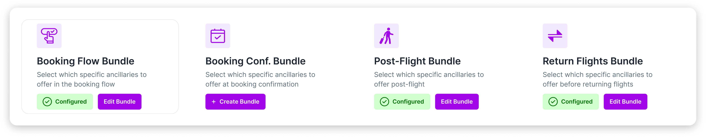

Tenant personnel will have access to a Arcube Tenant dashboard where all
ancillary products and suppliers are aggregated and easily managed by
the airline's commercial team. Through this platform, tenant personnel
can configure which ancillaries are offered, adjust pricing and markups,
and monitor transaction-level data and detailed sales insights. The
dashboard also allows the tenant to control how ancillary offers are
displayed across each touchpoint, including the booking flow,
pre-departure, post-flight, and more.

### Personalisation

Arcube uses proprietary recommendation algorithms to deliver the most
relevant offers at the right time, helping tenants maximise sales and
conversion rates. Arcube's algorithms handle what to recommend; no
additional dev work needed for recommendation logic beyond passing
Arcube the passenger data

### Passenger Recommendation Engine

Arcube's passenger recommendation engine works in real time and:

-   Considers factors such as destination, fare class, number of passengers, travel dates and trip type (one-way or return).

-   Curates a personalised offer during the booking flow and at other passenger touchpoints.

-   For example, when recommending eSIMs, the AI automatically checks where the passenger is travelling and the duration of stay (if it is a return flight) to estimate the right data package and displays it in under two hundred milliseconds.

-   Arcube’s team will work closely with each tenant during setup to configure how these offers are shown to passengers for each ancillary.

### Supplier Selection Algorithm
Arcube uses a multi-supplier model for each ancillary to maximise coverage, secure local partnerships, lower costs, and increase profit margins for each of the tenants.

For example, if a passenger needs lounge access at a specific airport, the AI will:

- Scan all suppliers in the network to find those that support that lounge.
- Check each supplier’s customer support reputation and service history.
- Compare live inventory and pricing from supplier APIs to find the best price for the same lounge.
- Select the supplier that balances affordable cost for the passenger with the highest profit margin for the tenant.

Arcube is continually adding new suppliers to improve service quality, expand coverage,
increase affordability, and secure the best margins for the airline

### Other Features on Arcube's Tenant Dashboard

#### Sales Tracking

- Airlines can view and track transaction-level data, including order status, detailed booking information, flight itinerary, purchased ancillaries, and the net profit per transaction. This is available via the Arcube web dashboard (not via API)
- Tenant personnel also have access to a dedicated analytics section with aggregated sales data, visual graphs, and dashboards. This includes insights such as sales performance over a selected time period, top-selling ancillaries, performance by touchpoint, and overall sales and profit by ancillary type, among other key metrics.

<small> Figure : Sales Tracking Feature on Arcube's Airline Dashboard </small>

### Customising Pricing

- For each ancillary, tenant personnel can transparently see the fixed cost price per ancillary and the average price for ancillaries with variable pricing, such as eSIMs (which vary by country and data package selected).
- Tenants can then set its desired price to passenger markup as a percentage.
- The platform offers complete flexibility, allowing tenant admins to configure pricing for each ancillary individually. Any changes made to the markup are applied in real time with no delay.

  ---------------------------------------------------------------------------------------------------------
    
  ---------------------------------------------------- ----------------------------------------------------

  ---------------------------------------------------------------------------------------------------------

<small> Figure : Ancillary Details and Pricing Configuration within Arcube's Airline Dashboard </small>

### Templates

- Tenants can use Arcube’s intuitive email, SMS, and WhatsApp editors to create custom templates for multiple touchpoints, including pre-departure, post-flight, and other key moments. All communications are fully customised to match Tenant’s branding, ensuring a consistent brand experience and building passenger trust.
- Tenants can also leverage pre-set templates and proven copy crafted to maximise open rates, click-through rates, and conversion rates.

<small> Figure : Email Configuration Feature within Arcube's Airline Dashboard </small>

### Touchpoints

- Tenants  can configure multiple touchpoints for ancillary upsells, including in the booking flow, booking confirmation, pre-departure reminders, post-landing offers, return flights, and the Manage My Booking section.
- For each touchpoint, tenants can customise a tailored bundle to display only the most relevant ancillaries for that stage of the passenger journey.
- For example, it may not be useful to upsell lounge access or travel insurance after the passenger has arrived at their destination, but local eSIMs, carbon offsetting, or car rentals may be highly relevant.
- This approach avoids overwhelming passengers with too many options, shows them only what is relevant, and helps maximise ancillary sales.

<small> Figure : Bundles Feature within Arcube's Airline Dashboard </small>

### Payment Processing

**Arcube supports flexible payment processing options, tailored to the
integration method and the touchpoints where ancillaries are offered.**

#### 1. Tenant-Processed Payments 

This is the default and preferred payment model for ancillaries sold
through:

-   Booking flow

-   Call centre

-   Travel agent portal

##### Process:

1.  The tenant (Merchant of Record) directly collects the payment in full from passengers (flight + all ancillaries).

2.  On a bi-weekly/monthly basis, the tenant remits ancillary costs to Arcube.

3.  Arcube then disburses payments to the relevant ancillary suppliers promptly.

**Note:** If Tenant's payment processor supports split payments, Arcube
can enable settlement at source, where each party receives their share directly at
the time of transaction.

#### 2. Arcube-Processed Payments

For ancillary sales through alternative touchpoints such as the whitelabelled website accessed through  post-booking, post-flight email communications, Arcube offers assistance to process payments, if needed. Arcube processes the payment securely through third-party providers, including local and global payment methods.Arcube collects the full payment and disburses the appropriate amounts to suppliers and tenant commission.

#### 3. Arcube-Hosted Site and Tenant Payments

Allows Arcube to handle the passenger ancillary purchase website, whilst the tenant
collects payments using usual channels. Methods of integrating the tenants payment
processors:

- Direct Integration - Arcube integrates with the tenants existing payment gateway, allowing customers to complete the transaction on the Arcube- hosted page while the tenant processes the payment in the background.

- Redirect Flow - Customers are redirected from the Arcube-hosted page to tenants domain to complete the payment securely using Tenant’s infrastructure. This model allows Tenant to maintain full control over the payment flow while still leveraging Arcube’s ancillary product and supplier integrations.

### Reconciliation

Regardless of the payment processing option selected above, the Arcube analytics
dashboard is available for all options and ensures full transparency and
reconciliation for all transactions.

Every party, tenant to supplier, has real-time visibility into what has been sold, what is due to
each party, tracking of those payments. With detailed breakdowns of each order and
intuitive filters, Arcube makes financial tracking, auditing, and settlement effortless and
accurate.

## 

<small>Figure : Example Invoicing and Payments Feature within Arcube's Airline
Dashboard</small>

### Accepted Payment Methods

Arcube supports a wide range of global and regional payment options to ensure flexibility,
accessibility, and high acquisition, low chargeback and low decline rates:

<small>Figure: Payment Processing Options Available on the Arcube Platform (if
Arcube is Merchant of Record)</small>

### Currency Support

The base currency for Arcube’s platform and ancillary suppliers is United States Dollars (USD).
However, passengers have full flexibility to view and pay in their local currency, either
automatically based on localisation data provided by the tenant or manually upon request.
Payment processing and settlement can be conducted in any supported local currency.

### Order Cancellation and Refunds

All cancellations and refunds are subject to the terms and conditions of the individual supplier, Arcube, and, where applicable, the Tenant.
By default, all ancillaries provided through the Arcube platform are non-refundable.
Cancellation policies vary depending on the type of ancillary and the specific supplier’s policy.
If a customer wishes to cancel an order, they must do so directly with the supplier using the
contact details provided in the order confirmation emails sent post purchase.
Cancellations cannot be processed once a service has been activated or consumed. If an order is cancelled before activation or use, a refund will only be issued if explicitly specified or agreed upon by the relevant supplier.

