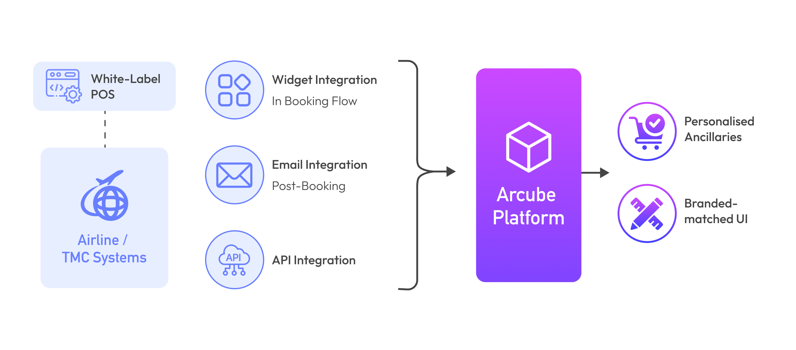

# Arcube Integration Guide

Welcome to the Arcube Integration Guide.  
This documentation will help you integrate Arcube's ancillary services into your systems.

---

## Overview of Integration Methods

Arcube offers three distinct integration methods for airlines, Travel Management Companies (TMCs), and other travel providers to seamlessly deliver personalized ancillary services to passengers: **Widget Integration**, **Email Integration**, **API Integration** and **White-Label Website Integration**.

These methods are designed to be flexible, allowing businesses to choose the option that best fits their customer engagement strategy, or even use all three methods concurrently for maximum impact.

Additionally, Arcube customizes the look and feel of both the iFrame and white-label website to match the partner’s branding and visual identity.

Section **Integation Methods** below briefly talks about the different integration methods that Arcube offers as part of its product.

Section **Integration Details** further below gives exact integration requirements in order to integrate with one or methods described above.

## Integration Overview Diagram

## Choosing the Right Integration Method

Arcube’s four integration methods allow businesses to choose the solution that best fits their needs:

- **Widget Integration** – Ideal for embedding ancillary offers directly within the booking flow, providing a seamless and engaging experience during the booking process.  
- **Email Integration** – Best for post‑booking engagements, allowing airlines and TMCs to offer personalized ancillary products after the initial booking, thereby increasing revenue before the journey begins.  
- **White‑Label Website Integration** – Provides a fully branded, dedicated Point of Sale where passengers can purchase ancillary services after receiving an offer from the email.  
- **API Integration** – Provides the most flexibility, enabling airlines, TMCs, and other travel service providers to integrate ancillary offerings at any touchpoint in their own systems, whether during booking, travel, or post‑trip.  

There is no **better** or **worse** integration method — the more integration points a tenant implements, the more conversion opportunities they are likely to generate.  
The real question is **what is technically feasible** for the tenant, based on their technology stack, platform limitations, and integration capabilities.  

Having this in mind, Arcube has crafted a product that supports **a spectrum of integration approaches**, from **simple** to **advanced**, ensuring that every tenant can find the right fit for their technical environment and business objectives.

By using one or more of these integration methods, travel providers can maximize their ancillary revenue while delivering a personalized and seamless experience for their passengers.

---

## Contents
- [Business Context](arcube-product-overview.md)
- [Integration Methods](integration-methods/widget.md)
- [Integration Details](integration-details/overview.md)

