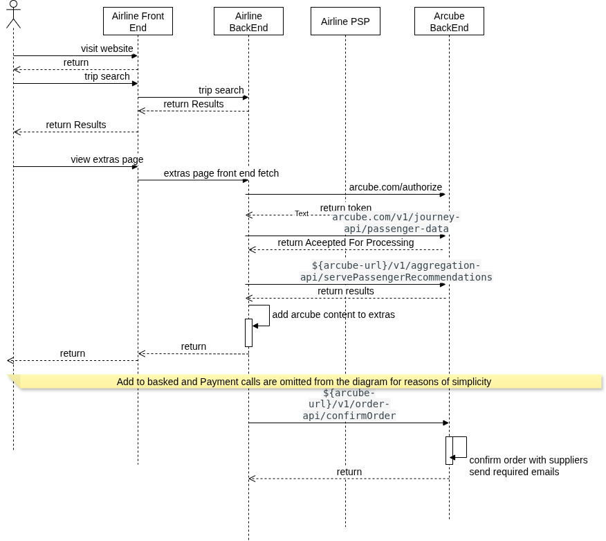

# API Integration (Direct Integration)

## How It Works

The API Integration method allows airlines, TMCs, and other travel service providers to directly integrate Arcube’s ancillary recommendation engine into their own platforms using a **RESTful API**.

This method provides maximum control and flexibility, enabling you to offer personalized ancillaries during any phase of the user journey.
### Sample Sequence Diagram

<small> Figure : Example Process and required calls for integrated with Arcube using the direct integration method </small>
---

## 1. API Request

The airline or TMC backend sends **passenger and trip data** to Arcube via a secure POST request.  
→ Refer to [Ingest Passenger Data](./essential-api-calls.md#61-ingest-passenger-data) for request details.

---

## 2. Personalized Ancillaries

Once data is ingested, the tenant calls Arcube to **serve passenger recommendations**.  
→ See [Serve Recommendations](./essential-api-calls.md#62-serve-recommendations).

Arcube responds with a list of personalized ancillary products, tailored by destination, timing, and passenger profile.

---

## 3. Integration into the User Journey

The tenant integrates the recommended ancillaries into any customer-facing channel, such as:

- Booking pages
- Mobile apps
- Passenger portals
- Pre-departure emails

This allows full flexibility on **when and how ancillaries are displayed**.

---

## 4. Payment Handling

In this model:

- The **tenant handles the full checkout process**, bundling ancillary charges with flights or other services.
- The tenant collects payment from the passenger directly.

---

## 5. Order Confirmation to Arcube

After payment is captured, the tenant must notify Arcube to **finalize ancillary fulfillment** with the vendors.

→ Refer to [Confirm Order](./essential-api-calls.md#63-confirm-order) for details on how to complete this step.

---

## Customization of Look and Feel

Since the UI is implemented by the tenant, the API integration enables **full design control**:

- Display ancillaries however you like
- Match your branding and layout standards
- Integrate within native apps or web flows

Arcube only provides the data — you design the experience.

---

## Security Considerations

- **HTTPS Encryption**  
  All API communication is encrypted using HTTPS, ensuring secure transport of passenger and booking data.

- **Authentication**  
  Access to Arcube APIs is protected via **JWT tokens** or **OAuth**, restricting usage to authorized systems only.

- **Privacy Compliance**  
  Arcube processes only **anonymized passenger data**, aligning with GDPR and global privacy standards.

