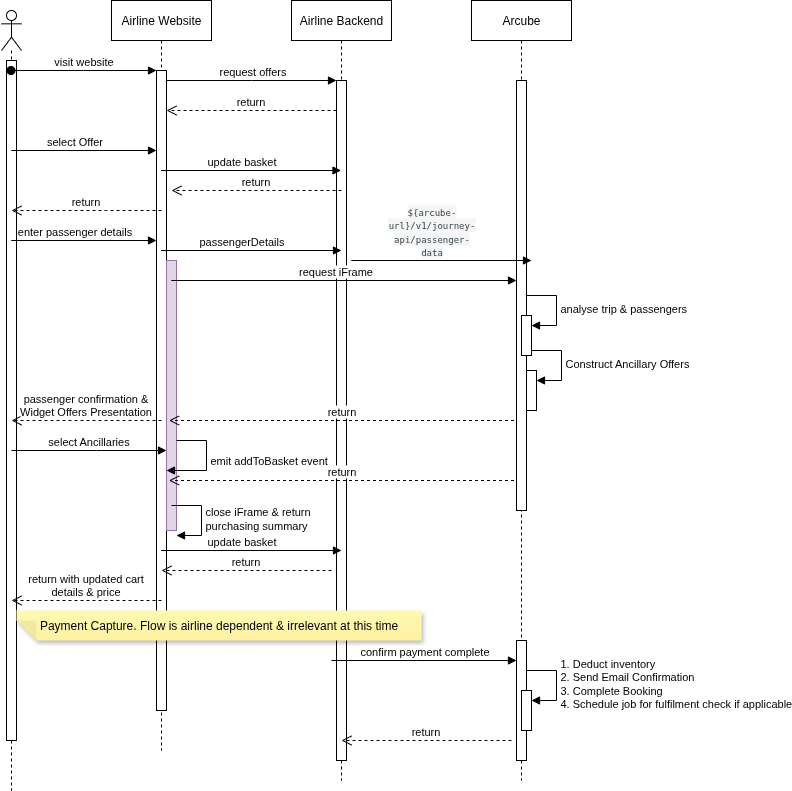

# Widget Integration (Embedded Solution)

## How It Works

Depending on whether the airline's IBE (Internet Booking Engine) uses an NPM-compatible framework or not, Arcube provides two integration methods:

- **NPM Package**
- **JavaScript Script Injection**

### Sample Activity Diagram



<small> Figure : Example Process and required calls for integrated with Arcube using the direct integration method </small>

The steps below describe how to integrate the Arcube Widget into the tenant's IBE.

---

## 1. Collect Passenger Contextual Data

The front-end collects contextual data such as:

- Trip details
- Passenger type
- Loyalty status

This data is passed to the **tenant’s back-end**, which must call the [Ingest Passenger Data](./essential-api-calls.md#61-ingest-passenger-data) API.

---

## 2. Widget Activation, Authentication & Rendering

### Widget Authentication
Arcube widgets are designed to be embedded directly into tenant (e.g., airline) websites without requiring any backend integration from the partner side. To ensure secure communication and prevent unauthorized use, the following authentication flow is used:

### Authentication Flow
When the airline embeds the widget, they reference a dynamic bootstrap script:
```jsx
<script src="https://tenantx.arcube.com/widget-loader.js"></script>
```

- Validates the request origin (via Origin or Referer headers).

- Generates a short-lived, signed JWT initialization token (initToken) specific to the client and request.

- Uses the token to make all subsescuent calls to Arcube's backend.

####Upon initialization, the widget:

- Sends the initToken and clientId to the Arcube backend to request a short-lived session token.

- If the initToken is valid (signature, expiration, origin match), the session token is issued.

- The session token is then used to authenticate subsequent API calls (e.g., order creation).

## 2. Ancillary Selection Event
When a user selects an ancillary product in the widget, the widget emits an event to the parent window. The front-end listens and handles this event.
```json 
{
  "sessionId": "fkdsjf-f123-4567",
  "event": "addToCart",
  "selectedAncillaries": [
    {
      "vendor": "brb",
      "id": "e9b1d12f-8f1d-4f32-9c3e-8d928c1b3ff4",
      "price": {
        "amount": 35.00,
        "currency": "USD"
      }
    }
  ]
}
```
## 3. Proceed to Payment (Optional)
When the user proceeds to payment, the IBE may:

- Close the widget, or

- Emit a message to the widget using ```postMessage()``` to retrieve a summary.

####IBE Emit: Proceed to Payment
```json 
{
  "event": "proceedToPayment",
  "data": {
    "sessionId": "user-12345"
  }
}
```
### Widget Responds with Summary
```json 
{
  "sessionId": "user-12345",
  "totalPrice": {
    "amount": 85.00,
    "currency": "USD"
  },
  "selectedAncillaries": [
    {
      "vendor": "brb",
      "id": "e9b1d12f-8f1d-4f32-9c3e-8d928c1b3ff4",
      "price": {
        "amount": 35.00,
        "currency": "USD"
      }
    },
    {
      "vendor": "mozio",
      "id": "e9b1d12f-8f1d-4f32-9c3e-8d564c1b3ff4",
      "price": {
        "amount": 50.00,
        "currency": "USD"
      }
    }
  ]
}
```
## 4. Tenant Confirms Payment to Arcube
Once the payment is captured, the tenant must notify Arcube to finalize booking with the vendors.

####Request Payload
```json 
{
  "sessionId": "user-12345",
  "transactionId": "trx1",
  "totalAmountPaid": 85.00,
  "ancillaryIds": [
    "ancillary-id-001",
    "ancillary-id-002"
  ],
  "paymentStatus": "success"
}
```
####Arcube Response Payload
```json 
{
  "status": "PARTIAL-SUCCESS",
  "sessionId": "user-12345",
  "transactionId": "trx1",
  "message": "Booking failed for some ancillaries.",
  "failedAncillaries": [
    {
      "id": "e9b1d12f-8f1d-4f32-9c3e-8d928c1b3cc6",
      "reasonCode": "NOT_AVAILABLE"
    }
  ],
  "succesfullAncillaries": [
    {
      "id": "e9b1d12f-8f1d-4f32-9c3e-8d928c1b3bb5",
      "reasonCode": "SUCCESS"
    },
    {
      "id": "e9b1d12f-8f1d-4f32-9c3e-8d928c1b3dd7",
      "reasonCode": "SUCCESS"
    }
  ],
  "totalRefundAmount": {
    "amount": 35.00,
    "currency": "USD"
  },
  "errorDetails": [
    "Extra baggage is not available for booking at the moment."
  ]
}
```
###Customization of Look and Feel
Arcube offers full visual customization of the widget to match the partner’s branding. This includes:

- Colors
- Fonts
- Logos
- Overall layout

This ensures the widget feels like a native part of the partner’s IBE.

###Security Considerations

- JWT Tokens or HMAC Signatures: Used to validate authenticity and prevent tampering.

- HTTPS Encryption: All API and widget communication is encrypted over HTTPS.

- No Sensitive Data in Front-End: Only signed widget URLs are passed to the browser — no PII or raw session data.


